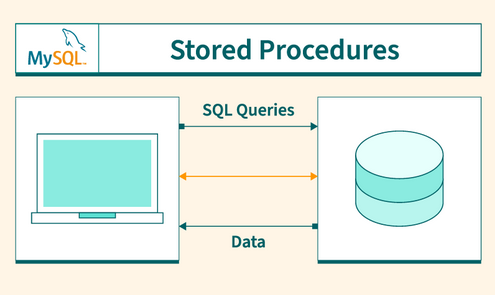

# Procedure in MySqL

A procedure in MySQL is a stored program or a set of SQL statements that are stored on the database server and can be executed on demand. Procedures allow you to encapsulate repetitive or complex operations, reducing duplication and improving maintainability. Procedures in MySQL operate synchronously. Therefore, for CPU-intensive tasks, it is highly recommended to use an asynchronous approach. Executing a CPU-intensive task within a procedure can block the process, causing the system to remain unresponsive until the task is completed. Each client connection to the database server, authenticated with a username and password, is assigned a dedicated thread to handle command execution.




create procedure syntax:

```sql
DELIMITER //
CREATE PROCEDURE procedure_name()
BEGIN 
    /* Query/ set of queries for execution */
    select * from employees;
END //
DELIMITER;
```

to call the procedure: 

```sql
call procedure_name();
```

Paramitarized procedure:

```sql
DELIMITER //
CREATE PROCEDURE procedure_name(IN lim INT, IN ofset INT)
BEGIN 
    SELECT * FROM application_documents ORDER BY id LIMIT lim OFFSET ofset;
END //
DELIMITER;

CALL procedure_name(500,10);
```

To drop a procedure:

```sql
drop procedure procedure_name;
```


To pass table / database dynamically:

```sql
DELIMITER //
CREATE PROCEDURE my_procedure(IN lim INT, IN db_name VARCHAR(25),IN tbl_name VARCHAR(25), IN ofset INT)
BEGIN 
    SET @query = CONCAT('SELECT * FROM ', tbl_name, ' ORDER BY id LIMIT ', lim, ' OFFSET ', ofset);
    PREPARE stmt FROM @query; /*This tells MySQL to prepare the query and associate it with the stmt identifier.*/
    EXECUTE stmt; /*This executes the SQL query stored in the stmt prepared statement. The query that was constructed dynamically (stored in @query) will now be run by MySQL.*/
    DEALLOCATE PREPARE stmt; /* This releases the memory and resources that were allocated to the prepared statement stmt. After this, the stmt identifier is no longer valid and can no longer be used. */
END //
DELIMITER ;

CALL my_procedure(10,'db_name','table_name',100);

```


paramitarized loop with brake statement:

```sql

DELIMITER //
CREATE PROCEDURE myxk_xx(IN myvar INT)
BEGIN
DECLARE counter INT DEFAULT 0;
DECLARE mystring VARCHAR(100) DEFAULT "";
myloop:
WHILE  counter <= myvar DO
   IF counter = myvar THEN 
   LEAVE myloop; 
   END IF;
   SET mystring = CONCAT(mystring, "x");
   SET counter = counter+1;
END WHILE;
SELECT mystring;

END //

DELIMITER;


CALL myxk_xx(10);


```

Nested while loop in procedure Example:


```sql
DELIMITER //
CREATE PROCEDURE ex_loop()
BEGIN
  DECLARE counter INT DEFAULT 0;
  DECLARE j INT DEFAULT 0;
  DECLARE i INT DEFAULT 0;
  DECLARE res VARCHAR(255) DEFAULT "";  
  WHILE i<=10 DO
    SET res = CONCAT("x",res);
    SET i = i + 1;
    SET j = 0;
    WHILE j<=2 DO
      SET res = CONCAT("_",res);
      SET j = j + 1;
    
    END WHILE;
  END WHILE;
  SELECT res;
END //
DELIMITER;
CALL ex_loop();

```

If Else condition

```sql
DELIMITER //
CREATE PROCEDURE ifelse(IN var INT)
BEGIN
IF var > 0 THEN 
  SELECT "number is positive";
 ELSE 
   SELECT "number is negative";
END IF;
END //
DELIMITER;


```


If else if and else with return data:

```sql

DELIMITER //

CREATE PROCEDURE GradeEvaluation(IN score INT, OUT grade VARCHAR(25))
BEGIN
  IF score >= 90 AND score<=100 THEN SET grade = 'A+';
  ELSEIF score >= 70 AND score < 80 THEN SET grade = 'A';
  ELSEIF score >=60 AND score <70 THEN SET grade = 'A-';
  ELSE SET grade = 'F';
  END IF;
END //
DELIMITER;


CALL gradeEvaluation(75, @grade);
SELECT @grade AS 'final result';

```

Before that we need to learn JSON:
JSON stands for JavaScript Object Notation.

JSON Functions:
MySQL provides a set of functions to manipulate and extract data from JSON objects and arrays. Some key functions are:
`JSON_ARRAY()`: Creates a JSON array from provided values.
`JSON_OBJECT()`: Creates a JSON object from key-value pairs.
`JSON_EXTRACT()`: Extracts data from a JSON document.
`JSON_UNQUOTE()`: Removes quotes from JSON string values.
`JSON_ARRAYAGG()`: Aggregates values into a JSON array.
`JSON_LENGTH()`: Returns the length of a JSON array or object.

Array in Procedure:

Lets convert a column data into array:

```sql
SELECT JSON_ARRAYAGG(column_name) FROM db_name.tbl_name
WHERE condition1 and condition2
```

Note: To make the array distinct

```sql
SELECT JSON_ARRAYAGG(author_name) AS distinct_authors
FROM (SELECT DISTINCT author_name FROM blogs) AS distinct_authors_subquery;
```

Now Let's check the length of the array:

```sql
SELECT JSON_LENGTH(JSON_ARRAYAGG(author_name)) AS distinct_authors
FROM (SELECT DISTINCT author_name FROM blogs) AS distinct_authors_subquery;

```

Now Let's print the i-th index of an array:

```sql
SELECT  JSON_UNQUOTE(JSON_EXTRACT(( SELECT JSON_ARRAYAGG(author_name)
FROM (SELECT DISTINCT author_name FROM blogs) AS dist_auth_subquery), CONCAT('$[',2 ,']'))); /* here 0,1,2 are the array index */

```


let's make a procedure which will store an array inside a variable and print the array :

```sql
DELIMITER //
CREATE PROCEDURE StoreAndPrintJSON()
BEGIN
    DECLARE json_result JSON;
    -- Storing JSON array in the variable
    SET json_result = JSON_ARRAY(1, "apple", TRUE, NULL);
    -- Printing the stored JSON array
    SELECT json_result AS my_json_array;
END //
DELIMITER ;

CALL StoreAndPrintJSON()
```

Let's Create a simple json and print it using procedure:

```sql
DELIMITER //
CREATE PROCEDURE CreateAndPrintJSON()
BEGIN
    DECLARE json_obj JSON;

    -- Creating a JSON object with key-value pairs
    SET json_obj = JSON_OBJECT('name', 'John', 'age', 30, 'city', 'New York');

    -- Printing the stored JSON object
    SELECT json_obj AS my_json_object;
END //

DELIMITER ;


CALL CreateAndPrintJSON()
```

Now Let's convert a select query result to array and print it:

```sql
DELIMITER //

CREATE PROCEDURE SelectToJSONArray()
BEGIN
    DECLARE author_array JSON;
   
    -- Convert the result of the SELECT query into a JSON array
    SELECT JSON_ARRAYAGG(author_name)
    INTO author_array
    FROM blogs;

    -- Print the JSON array
    SELECT author_array AS author_names_json_array;
END //

DELIMITER ;

CALL SelectToJSONArray();

```

Now, Lets convert from select result to Json Object:

```sql
DELIMITER //

CREATE PROCEDURE SelectToJSONObject()
BEGIN
    DECLARE json_result JSON;

    -- Convert the SELECT query result to JSON object
    SELECT JSON_OBJECT('author_name', author_name, 'post_title', title, 'author_photo',author_photo)
    INTO json_result
    FROM blogs
    LIMIT 1;  -- Modify based on the number of rows you want to return

    -- Print the resulting JSON object
    SELECT json_result AS blog_post_json;
END //

DELIMITER ;


CALL SelectToJSONObject();

```

Now Let's iterate over JSON_ARRAY:

```sql
DELIMITER //

CREATE PROCEDURE IterateOverJsonArray()
BEGIN
    DECLARE json_array_elem JSON;
    DECLARE author_name VARCHAR(255);
    DECLARE i INT DEFAULT 0;
    DECLARE array_length INT;
    DECLARE result VARCHAR(255) DEFAULT "";

    -- Example JSON array (you can modify this as needed)
    SET json_array_elem = JSON_ARRAY("John", "Jane", "Alice", "Bob");

    -- Get the length of the JSON array
    SET array_length = JSON_LENGTH(json_array_elem);

    -- Loop through the JSON array
    WHILE i < array_length DO
        -- Extract the element at index i (JSON arrays are 0-indexed)
        SET author_name = JSON_UNQUOTE(JSON_EXTRACT(json_array_elem, CONCAT('$[', i, ']')));

        -- Append the author name to the result string
        SET result = CONCAT(result, author_name, ",");

        -- Increment the counter to move to the next index
        SET i = i + 1;
    END WHILE;

    -- Remove the trailing comma from the result string
    SET result = LEFT(result, LENGTH(result) - 1);

    -- Return the concatenated authors list
    SELECT result AS authors_list;

END //

DELIMITER ;


CALL IterateOverJsonArray();
```

Let's Make an json object iterate using a while loop:

```sql
DELIMITER //

CREATE PROCEDURE IterateOverJSONObject()
BEGIN
    DECLARE JSON_OBJECT JSON;
    DECLARE author_key VARCHAR(255);  -- Changed variable name to avoid reserved word
    DECLARE VALUE INT;
    DECLARE i INT DEFAULT 0;
    DECLARE keys_count INT;
    DECLARE result VARCHAR(255) DEFAULT "";

    -- Example JSON object (you can modify this as needed)
    SET JSON_OBJECT = '{"John": 30, "Jane": 25, "Alice": 35, "Bob": 40}';

    -- Get the number of keys in the JSON object
    SET keys_count = JSON_LENGTH(JSON_KEYS(JSON_OBJECT));

    -- Loop through the keys of the JSON object
    WHILE i < keys_count DO
        -- Extract the key at index i
        SET author_key = JSON_UNQUOTE(JSON_EXTRACT(JSON_KEYS(JSON_OBJECT), CONCAT('$[', i, ']')));

        -- Extract the corresponding value for the key
        SET VALUE = JSON_UNQUOTE(JSON_EXTRACT(JSON_OBJECT, CONCAT('$."', author_key, '"')));

        -- Append the key-value pair to the result string
        SET result = CONCAT(result, author_key, ":", VALUE, ", ");

        -- Increment the counter to move to the next key
        SET i = i + 1;
    END WHILE;

    -- Remove the trailing comma and space
    SET result = LEFT(result, LENGTH(result) - 2);

    -- Return the concatenated result
    SELECT result AS key_value_pairs;

END //

DELIMITER ;


CALL IterateOverJSONObject();

```

If a process is running inside an INFINITY LOOP :

Step1: Find the process using `SHOW PROCESSLIST;`  
Step2: Kill the process using the ID: `KILL <ID>`


leave or break statement inside a loop:

```sql
DELIMITER $$

CREATE PROCEDURE break_in_while_loop()
BEGIN
    DECLARE counter INT DEFAULT 1;
    DECLARE summation INT DEFAULT 0;

    -- Label the loop as 'while_loop'
    while_loop: WHILE counter <= 10 DO
        SET summation = summation + 5;

        -- Check if counter equals 5, then break the loop
        IF counter = 5 THEN
            LEAVE while_loop;  -- This will break the loop
        END IF;

        -- Increment the counter
        SET counter = counter + 1;
    END WHILE;

    -- Return the summation value
    SELECT summation;
END$$

DELIMITER ;

CALL break_in_while_loop();


```


Calling procedure Inside another procedure:

```sql


DELIMITER //
CREATE PROCEDURE summation(IN valx INT, IN valy INT, OUT res INT)
BEGIN
  -- Use SET to assign value to the OUT parameter
  SET res = valx + valy;
END //
DELIMITER ;


DELIMITER //
CREATE PROCEDURE division(IN resx INT, OUT resy INT)
BEGIN
   DECLARE result INT; -- Local variable to store the result from `summation`
   -- Call the `summation` procedure
   CALL summation(23, 44, result);
   -- Perform the division and assign to the OUT parameter
   SET resy = result / resx;
END //
DELIMITER ;

CALL division(12,@resux);
SELECT @resux;

```


# Function In MySqL:

Syntax:

```sql

DELIMITER //

CREATE FUNCTION function_name(parameter_name datatype, ...)
RETURNS return_datatype
[DETERMINISTIC | NON-DETERMINISTIC]
[CONTAINS SQL | NO SQL | READS SQL DATA | MODIFIES SQL DATA]
BEGIN
    -- Function logic
    RETURN return_value;
END //

DELIMITER ;

```


Explanation:

`function_name`: Name of the function you are creating.
`parameter_name`: Input parameter(s) for the function. You can define multiple parameters separated by commas.
`datatype`: Data type for the input parameter(s).
`RETURNS return_datatype`: Specifies the data type of the value returned by the function.
`DETERMINISTIC`:
- `DETERMINISTIC`: The function always produces the same result for the same input.
- `NON-DETERMINISTIC`: The function may produce different results for the same input (e.g., functions using NOW() or RAND()).

SQL Characteristics (optional):
    `CONTAINS SQL`: The function contains SQL statements that do not read or write data.
    `NO SQL`: The function contains no SQL statements.
    `READS SQL DATA`: The function contains SQL statements that read data.
    `MODIFIES SQL DATA`: The function contains SQL statements that modify data.

BEGIN...END: Encloses the body of the function.
RETURN: Specifies the value the function should return.

Example:

```sql
DELIMITER //

CREATE FUNCTION square(num INT)
RETURNS INT
DETERMINISTIC
BEGIN
    RETURN num * num;
END //

DELIMITER ;

SELECT square(6);
```

Function with loop example:

```sql
DELIMITER //

CREATE FUNCTION functionWithLoop(num INT) RETURNS VARCHAR(255) DETERMINISTIC
BEGIN
  DECLARE i INT DEFAULT 0;
  DECLARE mystring TEXT DEFAULT "";  
  WHILE i<=num DO
    SET mystring = CONCAT(mystring,"x");
    SET i = i+1;
  END WHILE;
  RETURN mystring;
END //

DELIMITER;
   
SELECT functionWithLoop(260);

```